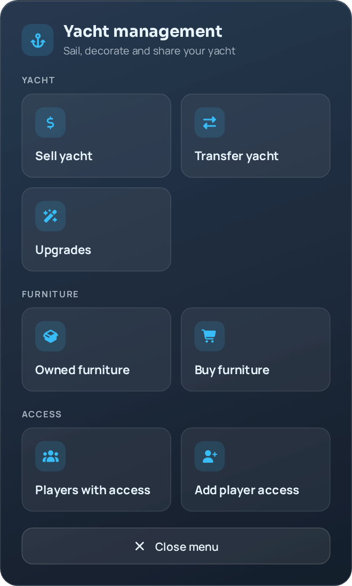
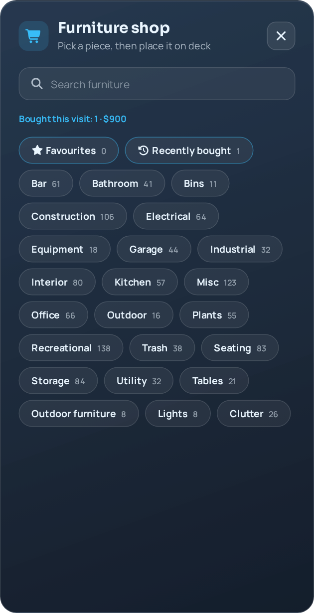
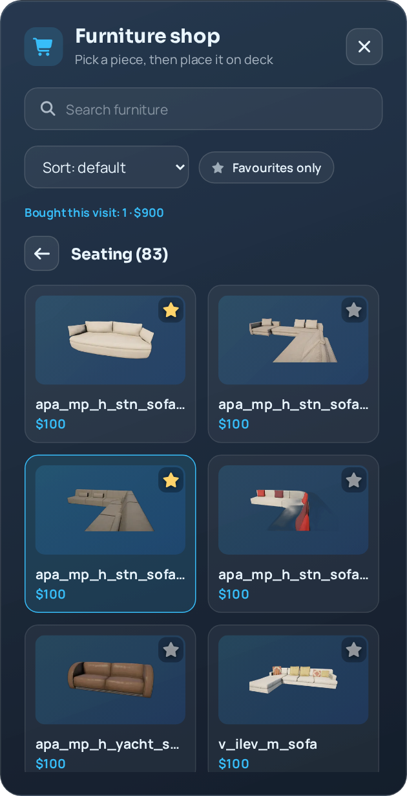
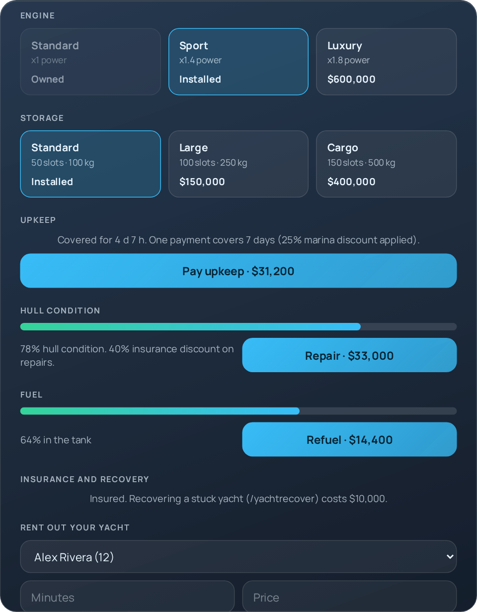
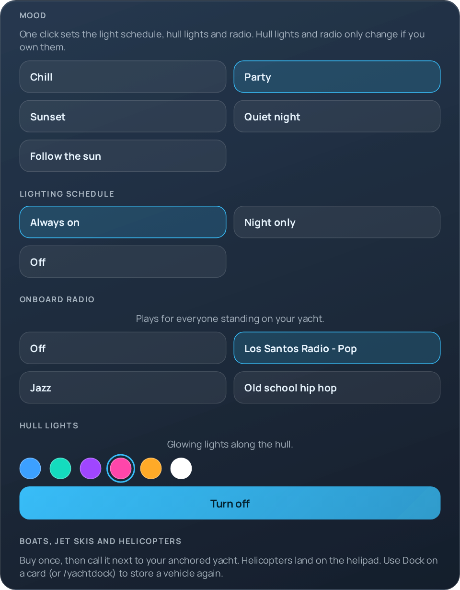
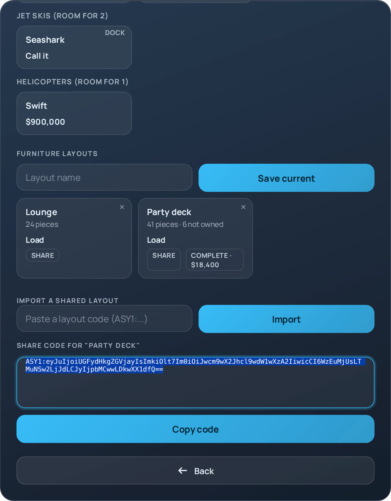
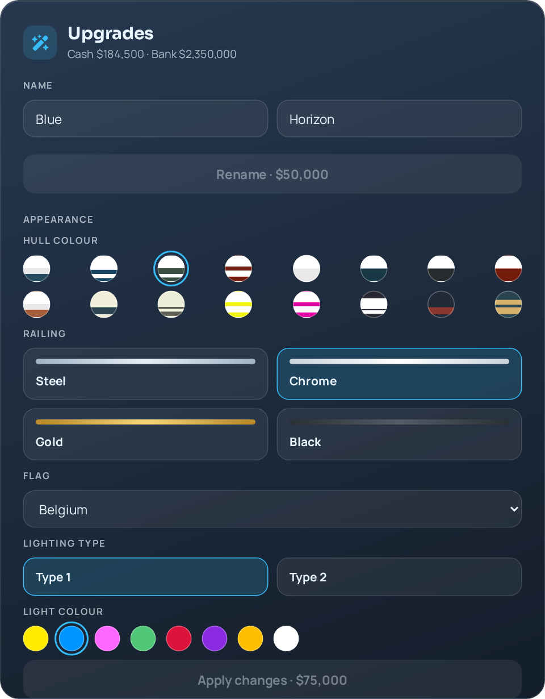
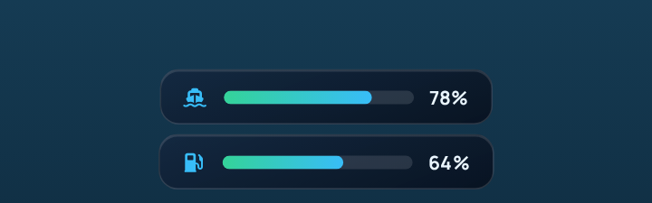

# as-yacht

Buyable, sailable, furnishable yachts for FiveM (ESX / QBCore / standalone). Requires `ox_lib`, `oxmysql` and the `as-yachtmodels` resource.

## Screenshots

Rendered from the real NUI (`html/`) with sample data. In game the panels sit over the world.

<table>
<tr>
<td align="center" width="33%"><br><sub><b>Management menu</b><br>Sell, transfer, upgrades, furniture and access</sub></td>
<td align="center" width="33%"><br><sub><b>Furniture shop</b><br>Search across every category, favourites, recently bought</sub></td>
<td align="center" width="33%"><br><sub><b>Category view</b><br>Sort, star favourites, running total of this visit</sub></td>
</tr>
</table>

<table>
<tr>
<td align="center" width="50%"><br><sub><b>Upgrades: economy</b><br>Engine and storage tiers, upkeep, hull condition, fuel, insurance</sub></td>
<td align="center" width="50%"><br><sub><b>Upgrades: comfort</b><br>Moods, light schedule, onboard radio, hull lights</sub></td>
</tr>
<tr>
<td align="center" width="50%"><br><sub><b>Layout sharing</b><br>Share a layout as a code, import one, buy the missing pieces</sub></td>
<td align="center" width="50%"><br><sub><b>Upgrades: name and appearance</b><br>Rename, hull colour, railing, flag and lights</sub></td>
</tr>
</table>

<p align="center"><br><sub><b>Sailing gauges</b> (fuel and hull condition) shown on a plain backdrop</sub></p>

The harbour master menu uses `ox_lib` context menus, so it is not shown here.

## Features

Everything is configured in `config.lua`; each system can be switched off with `enabled = false`.

| System | What it does | Config |
| --- | --- | --- |
| Buy, sail, anchor, sell, transfer | Core yacht ownership with permissions and rentals | sections 1-6 |
| Furniture | Shop (search across categories, sort, favourites, recently bought), placement editor with move steps from 5 mm to 1 m, layouts | `Config.Furnitures`, `Config.Comfort.layouts` |
| Layout sharing | Export a saved layout as a code and import one from another player. Imports are validated on the server against the catalogue and yacht limits. Missing pieces can be bought in one click | `Config.Comfort.layoutSharing` |
| Upkeep | Recurring berth/crew fee on real time (works offline). Overdue yachts lock, or optionally get repossessed | `Config.Upkeep` |
| Marinas | Harbour master NPCs to pay upkeep, refuel and repair. Mooring discounts, optional docking fees, map blips | `Config.Marinas`, `Config.Docking` |
| Sea state | Weather slows the engine and wears the hull, with storm warnings | `Config.SeaState` |
| Hull condition | Collisions and sailing wear the hull; low condition costs power and fuel; repairs cost money (insurance discount) | `Config.Condition` |
| Moods | One click sets light schedule, hull lights and radio; "Follow the sun" changes hull colour by time of day | `Config.Comfort.moods` |
| Fuel, insurance, recovery, tenders | Existing economy features | `Config.Fuel`, `Config.Insurance`, `Config.Comfort.tender` |

### Things to check in game

These depend on your map and models, so verify them once:

* **Marina coordinates** (`Config.Marinas.list`) are approximations. Stand where the harbour master should be and copy your coordinates.
* **Hull collisions** use the speed drop of the sailing vehicle. If impacts are too frequent or too rare, tune `Config.Condition.impactMinSpeed` and `impactDamagePerSpeed`.
* **Sea state** reads the current weather type on the driver's client, so it works with any weather sync resource. Set `Config.SeaState.enabled = false` to turn it off (`Config.CalmWater = true` also disables it).
* **Hull light points** (`Config.Comfort.hullLights.points`) are relative to your yacht model.

## Upkeep in detail

* A new yacht gets one free period. Existing yachts get one free period the first time the resource runs with upkeep enabled.
* The fee is `baseCost + furniturePercent% of the shop value of the furniture on board`, minus `marinaDiscount%` while moored in a marina.
* After the due date there is a `graceDays` period. Then the yacht is **locked** (cannot sail) until paid. With `onDefault = "repossess"` and `repossessDays > 0` it is removed instead (no refund).
* `autoPay = true` pays the fee from the owner's bank (then cash) when it falls due while they are online.
* Pay from Manage > Upgrades, or at any harbour master.

## Admin commands

Allowed for framework admins/gods, ACE `asyacht.admin`, or the server console. Names can be changed in `Config.AdminCommands`.

| Command | What it does |
| --- | --- |
| `/yachtinfo <id>` | Owner, position, anchored/sailing, marina, fuel, hull, insurance, upkeep, furniture count |
| `/yachtupkeep <id>` | Show upkeep status |
| `/yachtupkeep <id> forgive` | Reset the period (a full period of cover from now) |
| `/yachtupkeep <id> days <n>` | Set the days of cover left; a negative number makes it overdue (handy for testing locks) |
| `/yachtrepair <id>` | Free full hull repair |
| `/yachtfuel <id> [percent]` | Set the tank (default 100) |
| `/yachtcheck` | Re-run the configuration check and, in game, the model check |
| `/yachtlist`, `/yachtgoto <id>`, `/yachtdelete <id>` | List, teleport to, delete |

## Configuration check

With `Config.CheckConfigOnStart = true` the server console lists mistakes in `config.lua` a few seconds after start (bad numbers, unknown mood colours or radio stations, tenders without a parking spot, overlapping marinas, harbour masters far from their marina, conflicting furniture prices and more). `/yachtcheck` runs it again, and run in game it also checks on your client that every model (yacht, tenders, marina ped, furniture) is streamed, printing the missing ones to the F8 console.

## Exports (server)

```lua
exports['as-yacht']:HasYacht(serverIdOrIdentifier)         -- boolean
exports['as-yacht']:GetPlayerYachts(serverIdOrIdentifier)  -- { yachtId, ... }
exports['as-yacht']:GetAllYachts()                         -- { { yachtId, owner, anchored }, ... }
exports['as-yacht']:GetYachtData(yachtId)                  -- table | nil (includes fuel, condition, insured, upkeep)
exports['as-yacht']:GetYachtOwner(yachtId)                 -- identifier | nil
exports['as-yacht']:IsPlayerOnYacht(serverId)              -- yachtId | nil
exports['as-yacht']:GetYachtFuel(yachtId)                  -- percent | nil
exports['as-yacht']:GetYachtCondition(yachtId)             -- 0-100 | nil
exports['as-yacht']:GetYachtUpkeep(yachtId)                -- { status, seconds, cost, paidUntil, ... } | nil
exports['as-yacht']:GetYachtMarina(yachtId)                -- marina label | nil
exports['as-yacht']:GiveYacht(identifier, options?)        -- yachtId | nil
exports['as-yacht']:RemoveYacht(yachtId)                   -- boolean
exports['as-yacht']:TransferYacht(yachtId, identifier)     -- boolean
exports['as-yacht']:RecoverYacht(serverId, yachtId?)       -- boolean
```

## Events (server)

Listen with `AddEventHandler("asyacht:<name>", function(...) end)` in any server script.

| Event | Arguments |
| --- | --- |
| `asyacht:created` | `yachtId, owner` (every new yacht, including admin gives) |
| `asyacht:purchased` | `yachtId, owner, price, account` |
| `asyacht:sold` | `yachtId, owner, payout` |
| `asyacht:removed` | `yachtId, owner` (sold, deleted, repossessed) |
| `asyacht:transferred` | `yachtId, previousOwner, newOwner` |
| `asyacht:sailStarted` | `yachtId, driverServerId` |
| `asyacht:anchored` | `yachtId, coords` |
| `asyacht:refuelled` | `yachtId, price` |
| `asyacht:upkeepPaid` | `yachtId, owner, cost` |
| `asyacht:upkeepLocked` | `yachtId, owner` |
| `asyacht:repossessed` | `yachtId, owner` |
| `asyacht:damaged` | `yachtId, newCondition, amount, reason` (`"impact"` or `"wear"`) |
| `asyacht:repaired` | `yachtId, price` |

## Security notes

All gameplay events are validated on the server: the yachtId is normalised, the caller must own the yacht or hold the right permission, be near it, and stay under a per-player rate limit. Furniture coordinates are copied into clean vectors, permission values are forced to booleans, imported layout codes are parsed defensively, and prices are always read from `config.lua`, never from the client.
Hull impacts and sea roughness are reported by the driver's client; the server only accepts them from the current driver, rate limits them and decides the damage itself.

## Language

Set `Config.Language`. New strings live in `language/features.lua` (English); other languages fall back to English for missing keys.

## Resource layout

```
client/   core, appearance, buypreview, blips, init, events, buymenu, sailing, threads, nui, actions,
          manage, furniture, comfort, marina, seastate, validate, other
server/   main, other, commands, upgrades, economy, extras, marina, upkeep, condition, layouts, admin, validate, api
html/     NUI (ui.html, scripts.js, styles.css)
```

File-level state in `client/` is global so the modules share it; load order is defined in `fxmanifest.lua`.
